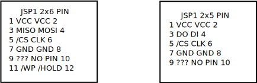

# JSPI1 MSI  to RPI converter

This project builds a JSPI Flash adapter
which allows to recver MSI Flash PIOS with RPi

It features a 1.8V or 3.3V interface. A level
converter is used to translate between
the voltages.

For the RPI the SPI0 is used:

GPIO10, Pin 19, MOSI
GPIO9, Pin 21, MISO
GPIO11, Pin 23, SCLK
GPIO8, Pin 24, CS

The two addition Pin of the 2x6 Connector are driven statically. But because these pins are going to be ran through the level converter it's a nice feature to have a UART Adapter for 1.8V Boards.

GPIO14, Pin 8, TX
GPIO15, Pin 10, RX

# High level Design

The connectors are done through severa jumper, so that one can swap the pin setting.
The board contains a break out are so that the adapter from 2.0 mm spacing to 2.5mm spacing can be broken off.

The voltage Regulator is AMS1117-1.8
The Level shifter is TXS0108EPWR  SOP-20

The Target is connected to Port A
The RPI is  connected to Port B
where VCC-A has to be smaller than VCC-B

The OE has to be driven from VCC-A thus we keep it always high.

